<h3>Installation de Ollama</h3>
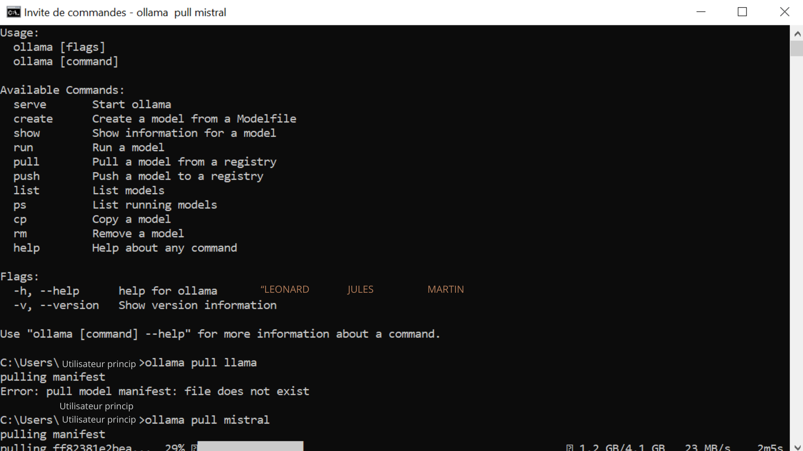

<h3>Test de Ollama</h3>
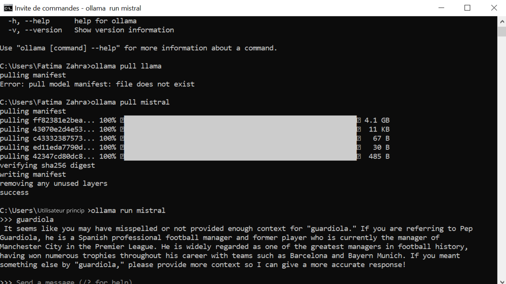

<h3>Test 1</h3>
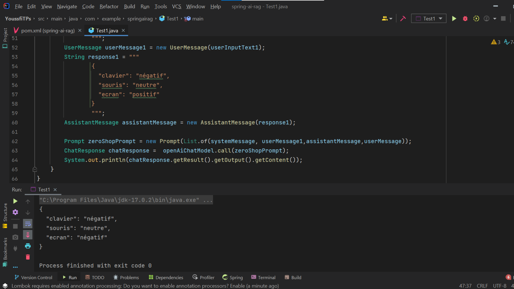

<h3>Test 2 avec Lliama</h3>
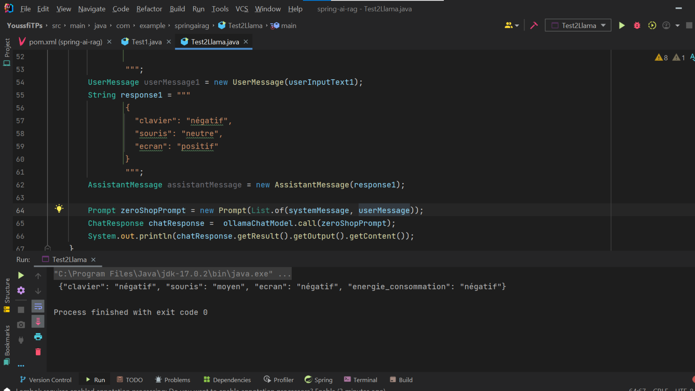

<h3>Open AI - Question</h3>
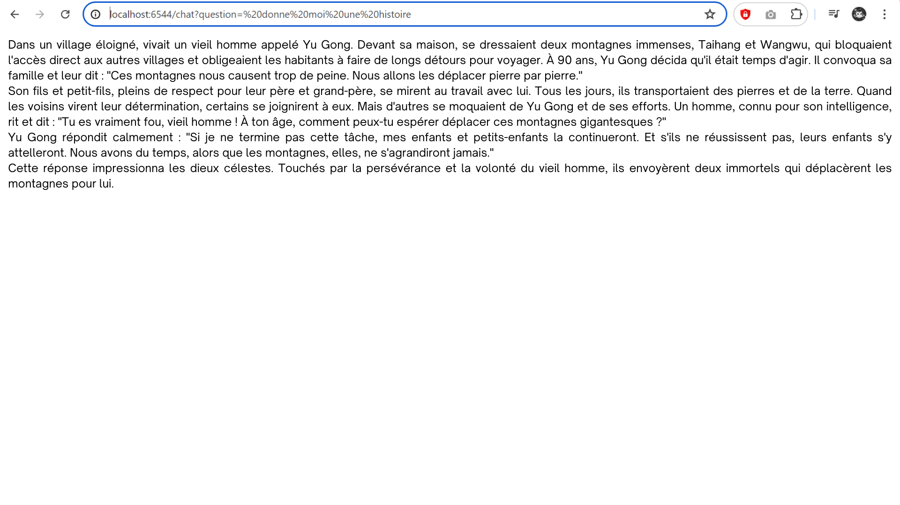
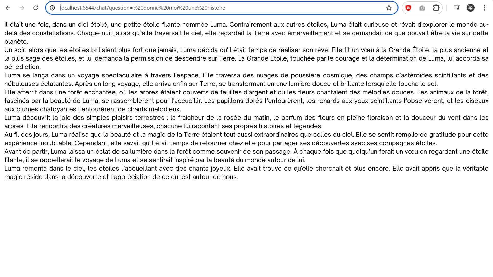

<h3>Open AI - Sentiment</h3>
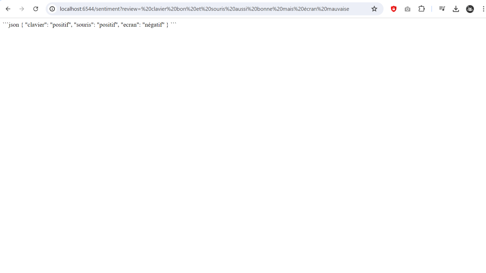
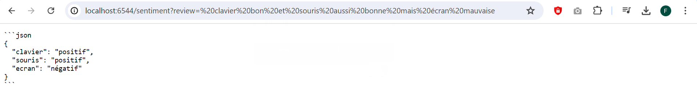
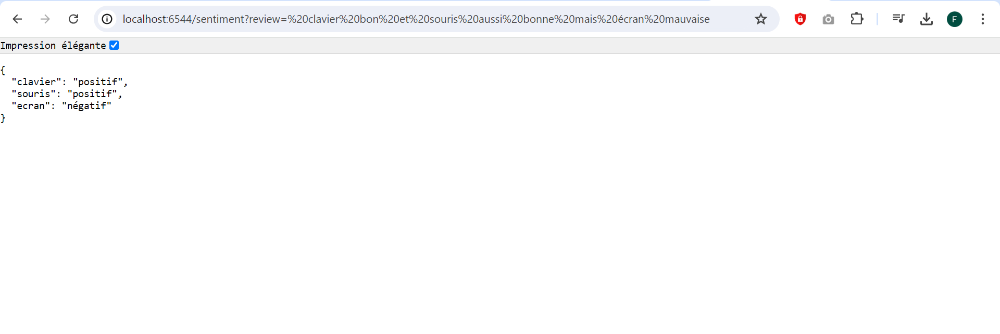

<h3>Open AI - Swagger</h3>
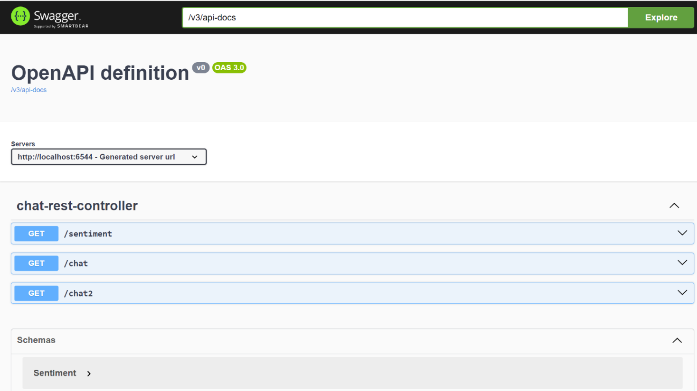

<h3>Open AI - Swagger GET</h3>
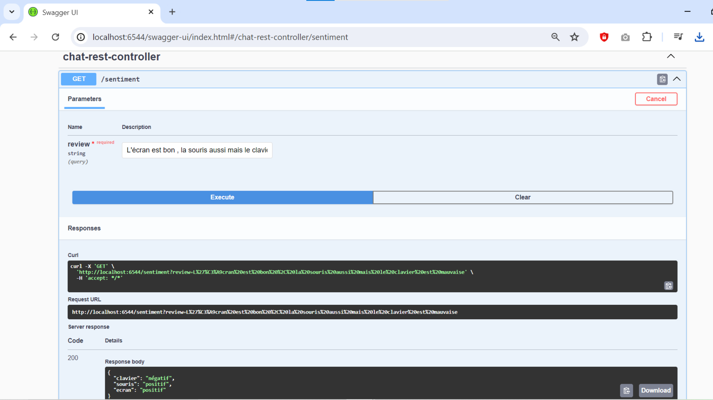

<h3>Open AI - Swagger POST</h3>
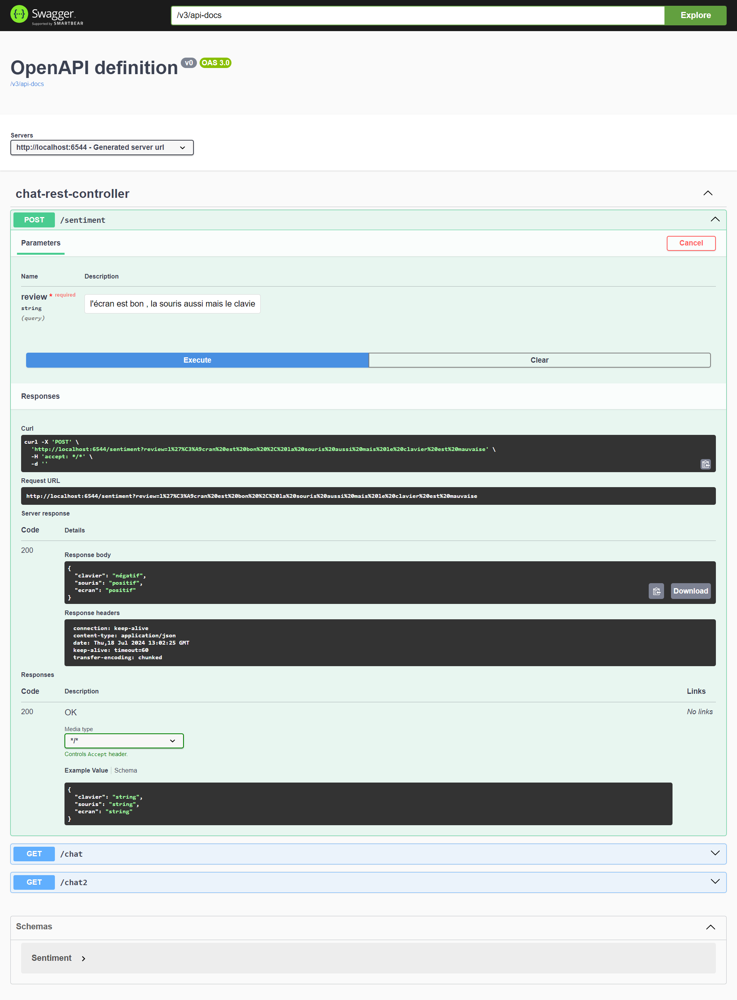

<h3>Open AI - Swagger GET (suite)</h3>
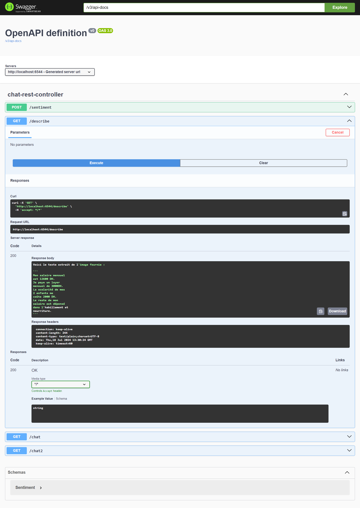
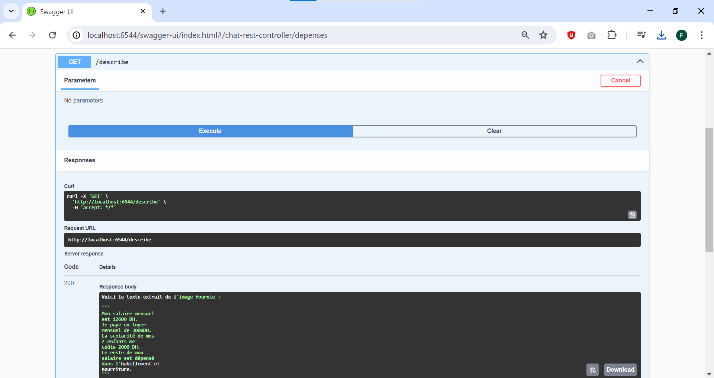
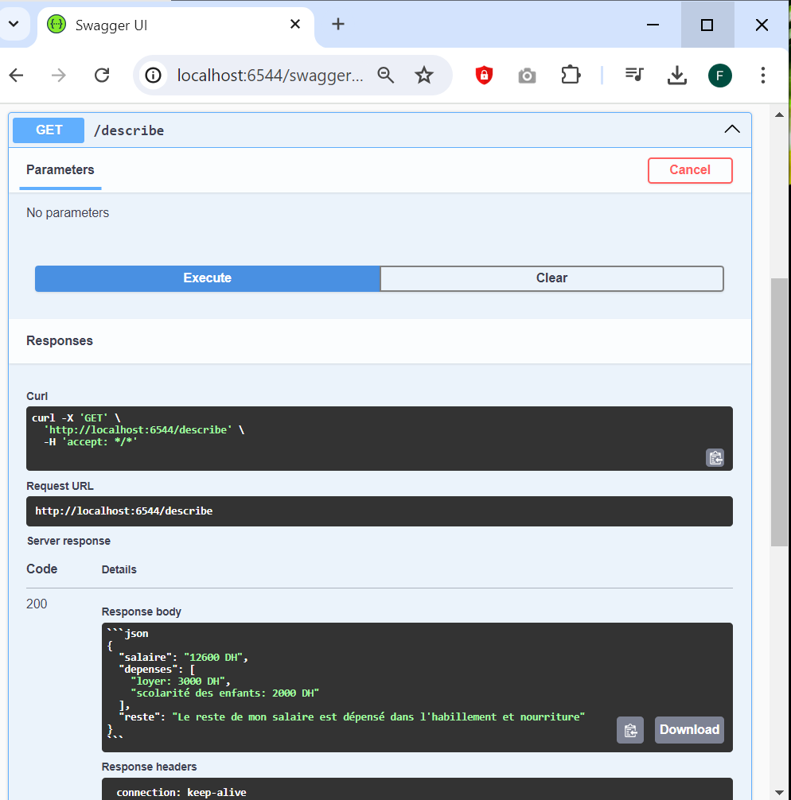

<h3>Open AI - Générer une photo</h3>
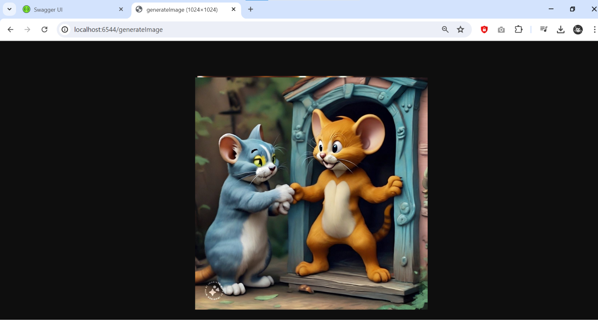

